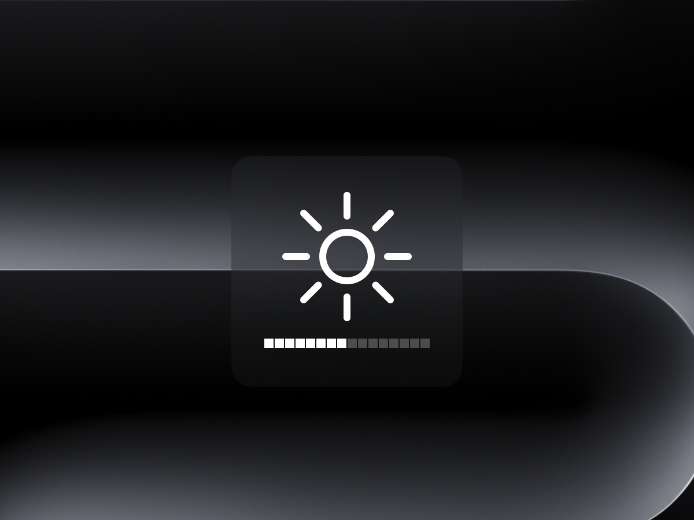
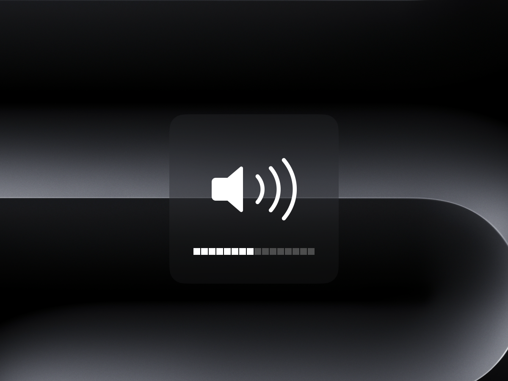
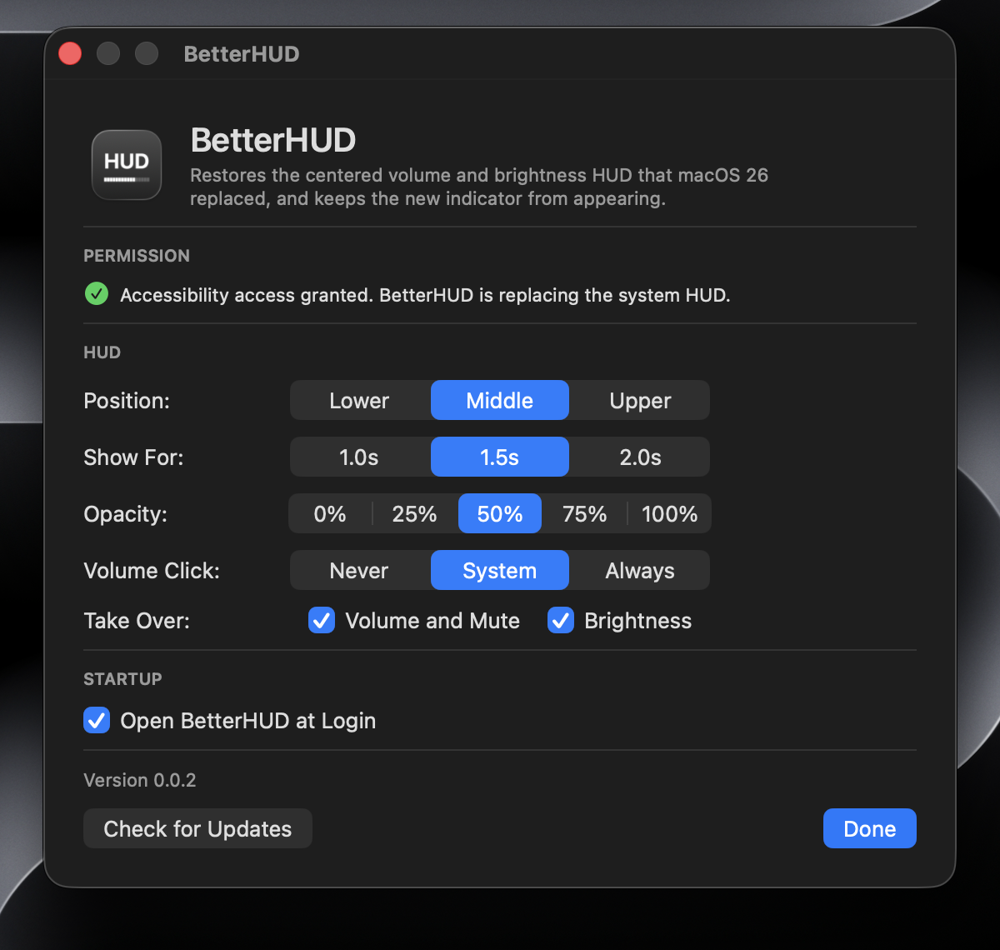

# BetterHUD

**Version 0.0.2 (September 4, 2026)**

macOS 26 changed the volume and brightness HUD to a small indicator in the
corner of the screen. I liked the old centered one better, so I wrote this to
bring it back. While BetterHUD is running, the new indicator doesn't show up at
all.

<p align="center">
  
  
</p>

## What it does

* Shows the old centered panel with the 16 segment bar
* Uses the HUD images that ship with macOS, so the icons are the real ones
* Changes volume, mute, and the built in display's brightness in 1/16 steps,
  same as the keys normally do
* Plays the volume click if you have that turned on in System Settings, and
  holding Shift flips it for one press
* Lives in the menu bar with no Dock icon and no dependencies
* Explains the one permission it needs the first time you open it

## Requirements

* macOS 13 or later. I built and tested it on macOS 26.6
* A Mac with a built in display, for the brightness part
* Accessibility permission

## Installing

1. Download the zip from the latest release and move `BetterHUD.app` into your
   Applications folder.

2. The first time you open it, macOS will block it. That's because I signed it
   with a local certificate instead of paying for an Apple Developer account, so
   Gatekeeper can't check who made it. Right click the app and pick **Open**,
   then confirm. Or from the terminal:

   ```sh
   xattr -d com.apple.quarantine /Applications/BetterHUD.app
   ```

   You only need to do this once.

3. Open it. A window comes up explaining what it does and the permission it
   needs.

## Permission

BetterHUD needs Accessibility permission so it can see the media keys before
macOS does. Go to **System Settings > Privacy & Security > Accessibility**, add
`BetterHUD.app`, and turn it on. You don't need to restart anything, it notices
within about a second. It does not need Input Monitoring.

## Settings

Click the menu bar item and pick Settings.

| Setting | Choices |
| --- | --- |
| Position | Lower, Middle, Upper |
| Show For | 1.0, 1.5, or 2.0 seconds |
| Opacity | Panel background at 0, 25, 50, 75, or 100 percent |
| Volume Click | Never, System, Always |
| Take Over | Volume and mute, Brightness, separately |
| Open at Login | On or off |

If you turn off one of the key types, those keys go back to working normally,
including the macOS indicator. The app only swallows a key press it actually
did something with.

## How it works

macOS draws its own indicator when you press the keys, and there's no setting
to turn that off. So instead of trying to hide it, BetterHUD catches the key
press before the part of macOS that draws the indicator ever sees it.

1. It sets up a `CGEventTap` for `NSSystemDefined` events at `.cghidEventTap`,
   which is the earliest point in the event pipeline, before WindowServer hands
   events out to anything else.
2. The callback returns `nil` for the volume, mute, and brightness keys, which
   throws them away. Key down and key up both get thrown away, so nothing
   leaks through.
3. Since the key press is gone, BetterHUD changes the volume or brightness
   itself and draws its own HUD.

Nothing polls in the background. The event tap, a CoreAudio listener, a display
change notification, and an accessibility change notification are the only
things that wake it up. The timer that hides the HUD only exists while the HUD
is on screen.

## What it can't do

* **External monitors.** Their brightness needs DDC/CI, which I haven't
  implemented. Only the built in display works.
* **Open without the Gatekeeper step**, until I get a Developer ID certificate
  and notarize it.
* **Keyboard backlight keys.** F5 and F6 still show the macOS indicator.
* **Be on the Mac App Store.** Event taps aren't allowed in sandboxed apps, so
  it has to be a direct download.

## Where the artwork comes from

The HUD icons are read at runtime from
`/System/Library/CoreServices/OSDUIHelper.app/Contents/Resources`. They aren't
copied into the app or this repo, so none of Apple's artwork is being
redistributed. If those files ever disappear, the HUD falls back to SF Symbols.

## Building it yourself

```sh
swift build -c release          # just the binary
./Scripts/build-app.sh          # builds and signs BetterHUD.app
swift Scripts/make-icons.swift  # regenerates the app icon
```

A copy you build yourself isn't quarantined, so you can skip the Gatekeeper
step.

The build script signs with a code signing certificate if it finds one, and
falls back to ad hoc signing with a warning. This matters more than it sounds:
an ad hoc signature is tied to the binary's hash, so every rebuild looks like a
different app to macOS and it drops the Accessibility permission you granted.
Use `BETTERHUD_SIGN_IDENTITY="Your Certificate Name"` for your own identity, and
`BETTERHUD_INSTALL_DIR` to change where the app gets built.

## Version history

### 0.0.2 (September 4, 2026)

* Added an opacity setting for the HUD panel, from solid down to no background
* Moved all the settings into one window, which is also the first launch setup
* Added an update check that looks at GitHub releases once a day, and a row in
  the menu when there's a new version
* Cut the menu down to Settings and Quit
* Reordered Position to Lower, Middle, Upper and Volume Click to Never, System,
  Always
* Dropped the 3 second option for how long the HUD stays up

### 0.0.1 (September 4, 2026)

First release.

* Catches the volume, mute, and brightness keys and stops the macOS 26
  indicator from showing
* Centered HUD using the artwork from macOS, with a 16 segment bar
* Volume, mute, and built in display brightness
* Volume click that follows the system setting
* First launch setup showing the permission status
* Menu bar settings

## Author

**Connor Podea**, CS student at Arizona State University.

## License

GPLv3.
